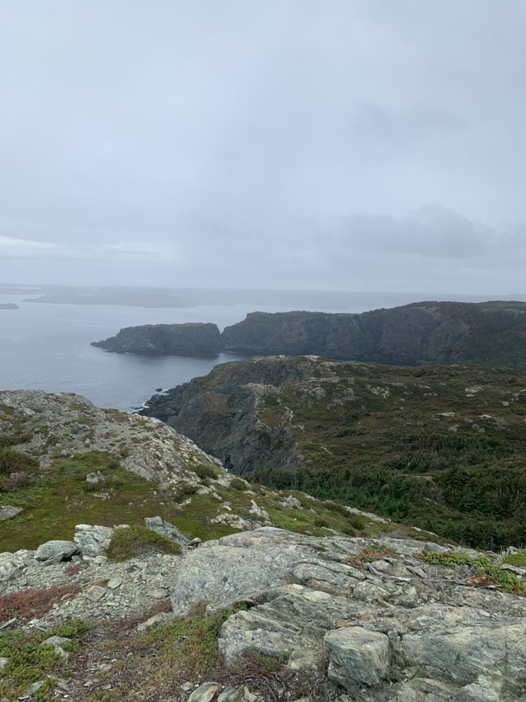

First post

This year was marked by personal growth, travelling, and new experiences. The highlights for me was the trip's to Lewisporte and Punta Cana. I finished 17 books, my favorites were [The Undertow](https://www.goodreads.com/book/show/61089467-the-undertow) and [Leadership: In Turbulent Times](https://www.goodreads.com/book/show/38657386-leadership). There was no shortage of tragety and big headline events in the world, and at times I found it distracting. In 2025 I want to try to focus on what is within my control. Focus and time management are two things I think I can improve on most.

